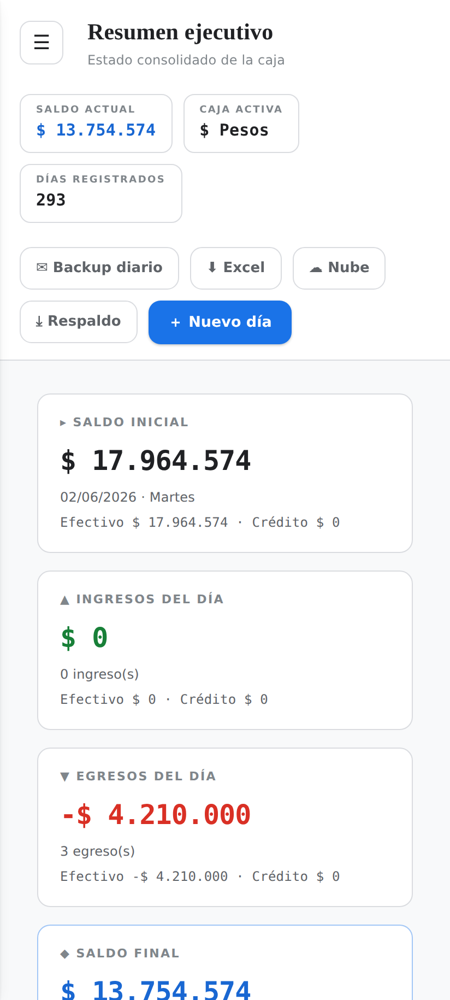
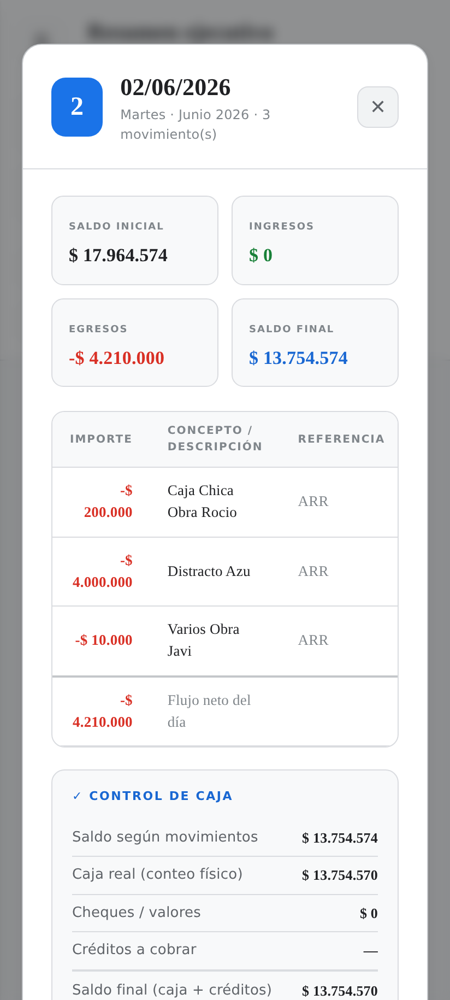

# 💵 Caja Diaria

Control de caja diaria para comercios (kioscos, locales, freelancers): registrá ingresos y egresos por día, mirá el saldo en vivo, hacé arqueo, llevá créditos a cobrar, préstamos entre empresas, cambio de divisa, exportá a Excel y respaldá todo automáticamente.

**🔗 Sitio en vivo:** https://speranzaemiliano-rk.github.io/caja-diaria/

<p>
  
  
</p>

---

## Qué hace

- **Movimientos diarios** — cargá ingresos/egresos con concepto, referencia e importe. El saldo final se calcula solo y arrastra al día siguiente.
- **Resumen del día** — saldo inicial, ingresos, egresos y saldo final, con el desglose de cuánto es efectivo y cuánto crédito.
- **Arqueo de caja** — cargá el conteo físico por partes (cajones, tandas) y compará contra lo que dicen los movimientos.
- **Créditos a cobrar** — saldo acumulado día a día, con ajustes itemizados (+/-) y el nombre de a quién corresponde cada uno.
- **Cheques / valores** — campo informativo por día.
- **Préstamos entre empresas** — transferencias entre distintas cajas (empresa/proyecto), con historial editable y un resumen de cuenta corriente (quién le debe a quién).
- **Cambio de divisa** — compra/venta de dólares dentro de la misma empresa, con cotización.
- **Multi-empresa / multi-proyecto / multi-moneda** ($ y US$), cada combinación es su propia "caja".
- **Análisis** — evolución del saldo, composición de ingresos/egresos, diferencias de caja, flujo mensual, principales conceptos, actividad por día de semana.
- **Exportación a Excel** (`.xlsx` real, generado sin librerías) y **respaldo `.json`** (exportar/importar).
- **Backup diario por email** — automático, con guía paso a paso para configurar el envío (Google Apps Script recomendado, corre del lado del servidor sin depender de abrir la app).
- **Sincronización en la nube** — la misma caja en todos tus dispositivos, en tiempo real (Firebase Firestore).
- **Instalable como app (PWA)** — funciona offline y se agrega a la pantalla de inicio en Android e iPhone, gratis, sin pasar por ninguna tienda.

## Cómo usarla

No hace falta instalar nada para probarla: entrá a [speranzaemiliano-rk.github.io/caja-diaria](https://speranzaemiliano-rk.github.io/caja-diaria/) y tocá **"Abrir mi caja"**.

Para tenerla como app en el celular: abrí el sitio y tocá **"Instalar app"** (Android) o seguí la guía **"Instalar en iPhone"** (Compartir → Agregar a inicio en Safari).

## Stack técnico

- **Sin build, sin frameworks, sin dependencias** — todo es HTML + CSS + JS inline en dos archivos (`index.html` la portada, `app.html` la caja). Se sirve tal cual, sin necesidad de compilar nada.
- **Persistencia local** en `localStorage` del navegador — tus datos viven en tu dispositivo.
- **Sincronización opcional** vía [Firebase Firestore](https://firebase.google.com/) (auth anónima).
- **Service worker** (`sw.js`) para funcionamiento offline y PWA instalable.
- **Deploy automático** a GitHub Pages en cada push a `main` (`.github/workflows/deploy-pages.yml`).

## Correr en local

```bash
git clone https://github.com/speranzaemiliano-rk/caja-diaria.git
cd caja-diaria
python3 -m http.server 8099
```

Abrí `http://localhost:8099/index.html` (portada) o `http://localhost:8099/app.html` (caja).

## Privacidad y datos

- Sin la sincronización activada, tus movimientos **nunca salen de tu navegador**.
- Con la sincronización activada, los datos viajan a un documento de Firestore identificado por un "código de caja" — cualquiera que tenga ese código puede leer/escribir esa caja. Por defecto la app usa un código embebido en el código fuente (público) para que cualquier dispositivo se conecte sin configurar nada; si necesitás privacidad real, generá tu propio código desde **☁ Nube → configurar código propio**.

## Contribuir / desarrollo

El proyecto no usa un pipeline de build: se edita `app.html` / `index.html` directamente. El archivo [`CLAUDE.md`](./CLAUDE.md) documenta en detalle el modelo de datos, las funciones clave y las convenciones internas — es la referencia técnica más completa del proyecto.

## Licencia

Proyecto personal — sin licencia de código abierto declarada.
